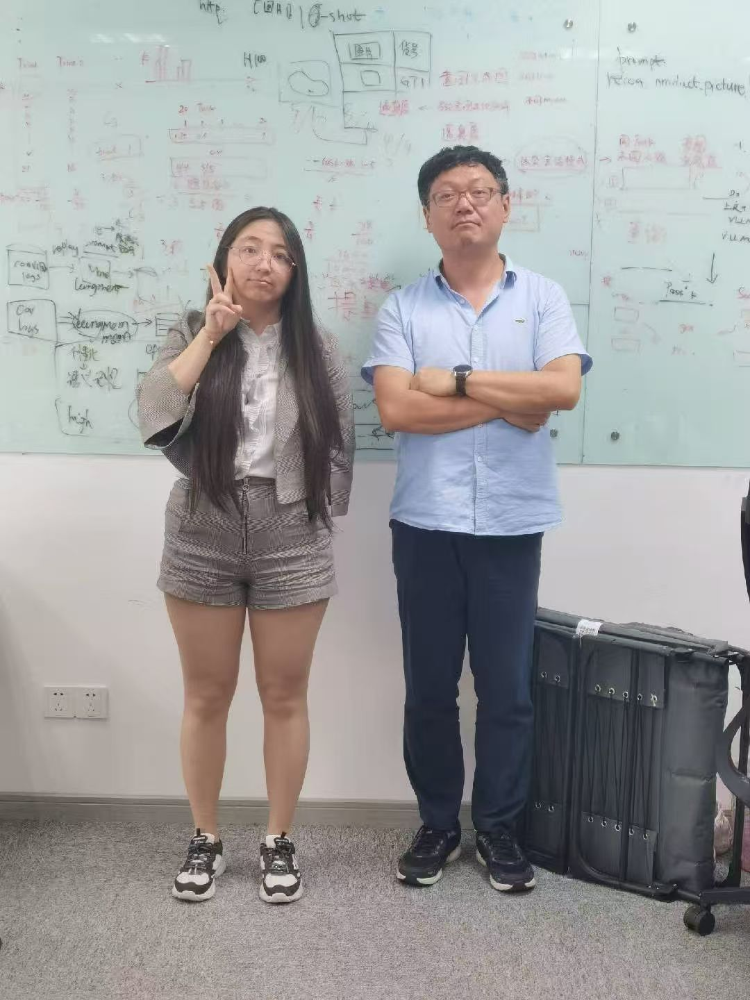
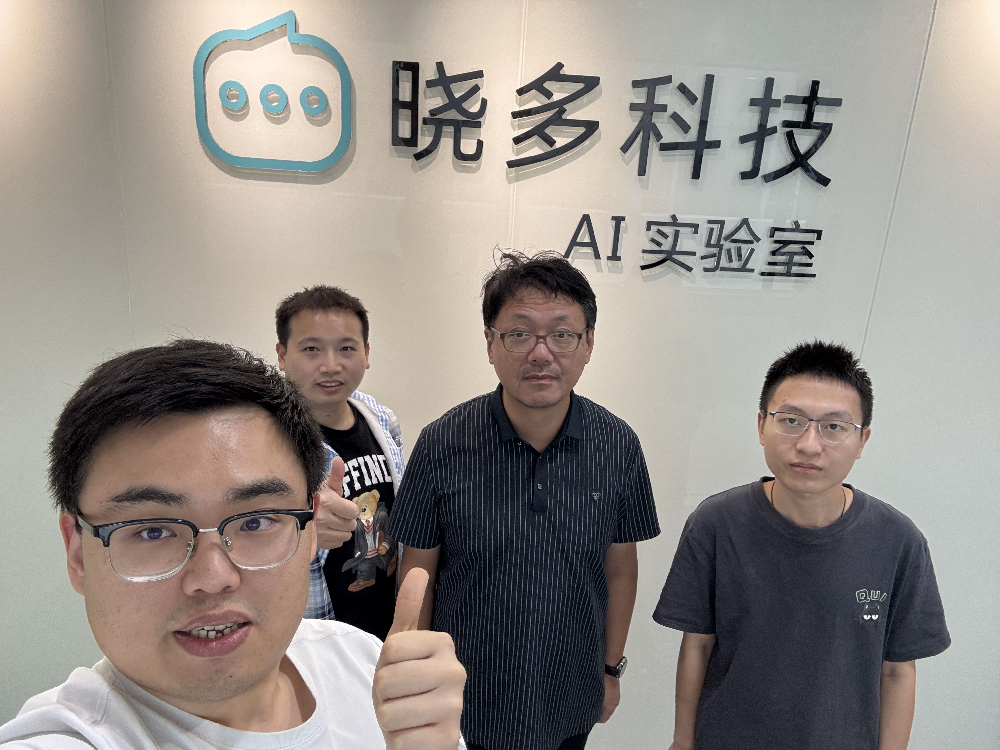

# Xiaoduo AI Lab - Project Archive

> Technical Discussion Records and Research Archive (2023-2025)

**Language Options**: [中文版本](README.md) | English Version

This repository contains technical discussion records and research archives from Xiaoduo AI Lab, which operated from October 2023 to September 2025. The lab focused on cutting-edge research in large language models, multimodal AI, and e-commerce AI applications.

- **`XiaoduoAILab_Discussion_LogBook_2023_11_14-2025_9_24.pdf`** - Complete technical discussion records during the lab's operation period
- **Research Papers** - Main publications and technical reports produced during the lab period

## 🎯 Research Directions

The lab focused on several key AI research areas:

- **Large Language Models** - Developing efficient, multilingual, and strongly reasoning lightweight large models
- **Multimodal Vision-Language Models** - Connecting visual and text understanding
- **Domain Models and Domain Agents** - Domain specialization of large models and agents

## 📚 Main Publications (2023-2025)

### Large Language Models
- **Xmodel-LM Technical Report** - *arXiv*
- **Xmodel-1.5: An 1B-scale Multilingual LLM** - *arXiv*
- **Xmodel-2 Technical Report** - *arXiv*

### Vision-Language Models
- **Xmodel-VLM: A Simple Baseline for Multimodal Vision Language Model** - *arXiv*

### Domain Models and Domain Agents
- **ECom-Bench: Can LLM Agent Resolve Real-World E-commerce Customer Support Issues?** - *EMNLP 2025*

  
| | |
|:---:|:---:|
|  **ECom-Bench Paper Poster** <small>EMNLP 2025 Conference Presentation</small> |  **First Author Wang Haoxin presenting ECom-Bench** <small>EMNLP 2025 Conference Site</small> |

- **MindFlow: Revolutionizing E-commerce Customer Support with Multimodal LLM Agents** - *arXiv*
- **MemOrb: A Plug-and-Play Verbal-Reinforcement Memory Layer for E-Commerce Customer Service** - *arXiv*
- **Survey of Specialized Large Language Model** - *arXiv*

## 🔬 Technical Contributions

### Model Development
- **Xmodel Series**: Developed lightweight large models with multilingual capabilities, strong reasoning, and agent abilities
- **Multimodal Integration**: Proposed a new projection method (XDP) for unified vision-language understanding
- **Memory Systems**: Developed plug-and-play memory layers enabling agents to learn from experience

### Domain Agent Simulation Evaluation and Deployment
- **ECom-Bench**: Introduced new elements in domain agent simulation evaluation ("persona-driven user simulation" and "multimodal")
- **MindFlow**: Validated domain agent performance in real customer service scenarios

### Applied Research
- **Multilingual**: Collaborated with Chulalongkorn University to develop Thai evaluation dataset Xdata_Thai, validating cross-language capabilities of lightweight large models
- **Multimodal**: Explored architectural forms of multimodal agents in e-commerce customer service scenarios
- **Efficiency Validation**: Deployed and stress-tested Xmodel series models on server-side (SGLang/vLLM) and client-side (Ollama), validating the cost advantages of lightweight models

> **Note**
> Chulalongkorn University (Thai: จุฬาลงกรณ์มหาวิทยาลัย) is a national research university in the Siam area of Bangkok, Thailand, and is the oldest university in Thailand.

## 📊 Timeline

## 📸 Lab Member Group Photos

The following are departure group photos of some lab members during the operation period, recording some members' names, schools, contributions, and photo dates:

| | | |
|:---:|:---:|:---:|
|  **Yan Yu** (Intern) Harbin Institute of Technology, Weihai **Custom Tokenizer** <small>2024/1</small> |  **Xu Wanting/He Langping** (2nd from left/3rd from right, Interns) East China Normal University/Donghua University **Xmodel-VLM** <small>2024/5</small> |  **Wang Yichuan** (Intern) Shanghai Jiao Tong University **Xmodel-LM** <small>2024/6</small> |
|  **Lin Qingquan/Qu Zhijiu** (2nd from right/1st from right, Interns) Wuhan University/Fudan University **Xmodel-2** <small>2024/12</small> |  **Liu Yang/Huang Xucheng** (Right/Left, Full-time) Peking University/Friedrich-Alexander-Universität Erlangen-Nürnberg **Distributed Training Framework, etc.** <small>2025/6</small> |  **Wang Qun** (Intern) Shanghai Maritime University **Xmodel-1.5+Xmodel-2** <small>2025/6</small> |
|  **Wang Haoxin/Peng Xianhan/Yang Chenghan** (3rd from left/4th from left/2nd from left, Interns) Shanghai Jiao Tong University **ECom-Bench** (Wang/Peng) **Domain LLM Survey** (Yang) <small>2025/6</small> |  **Gong Ming** (Intern) University of Dayton **MindFlow** <small>2025/8</small> |  **Huang Yizhe** (1st from right, Intern) Fudan University **MemOrb** <small>2025/9</small> |

## 🤝 Acknowledgments

We have learned from and referenced numerous papers and open-source achievements from the AI community. Although we strive to contribute back with modest efforts, what we have gained far exceeds what we have given. Whenever we think of this, we often feel a sense of humility.

## 🔗 Related Resources

To access actual models, datasets, or implementation code, please refer to the independent repositories associated with each paper.

---

*This archive serves as a comprehensive record of Xiaoduo AI Lab's technical contributions from 2023-2025.*

---

