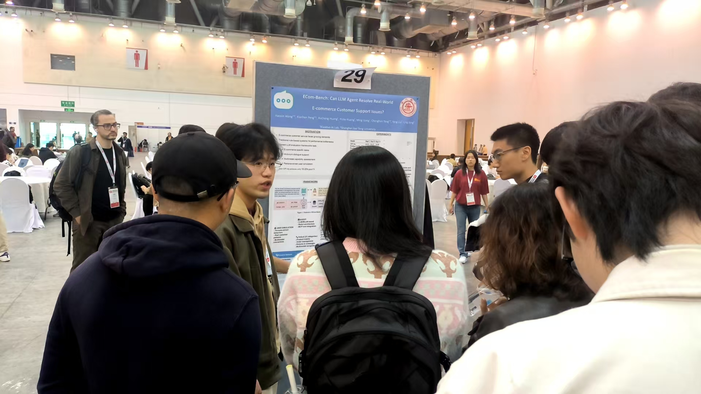
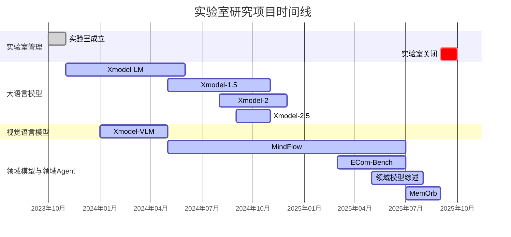

# 晓多AI实验室 - 项目归档

> 技术讨论记录与研究档案 (2023-2025)

本仓库包含晓多AI实验室的技术讨论记录和研究档案，实验室运营时间为2023年10月至2025年9月。实验室专注于大语言模型、多模态AI、和电商AI应用的前沿研究。

## 📁 仓库内容

- **`XiaoduoAILab_Discussion_LogBook_2023_11_14-2025_9_24.pdf`** - 实验室运营期间完整的技术讨论记录
- **研究论文** - 实验室期间产出的主要出版物和技术报告

## 🎯 研究方向

实验室专注于以下几个关键AI研究领域：

- **大语言模型** - 开发高效、多语言、强推理的轻量级大模型
- **多模态视觉语言模型** - 连接视觉与文本理解
- **领域模型与领域Agent** - 大模型和Agent的领域化

## 📚 主要出版物 (2023-2025)

### 大语言模型
- **Xmodel-LM Technical Report** - *arXiv*
- **Xmodel-1.5: An 1B-scale Multilingual LLM** - *arXiv*
- **Xmodel-2 Technical Report** - *arXiv*
- **Xmodel-2.5: 1.3B Data-Efficient Reasoning SLM** - *arXiv*

### 视觉语言模型
- **Xmodel-VLM: A Simple Baseline for Multimodal Vision Language Model** - *arXiv*

### 领域模型与领域Agent
- **ECom-Bench: Can LLM Agent Resolve Real-World E-commerce Customer Support Issues?** - *EMNLP 2025*

  
| | |
|:---:|:---:|
|  **ECom-Bench 论文海报** <small>EMNLP 2025 会议展示</small> |  **一作王浩新讲解 ECom-Bench** <small>EMNLP 2025 会议现场</small> |

- **MindFlow: Revolutionizing E-commerce Customer Support with Multimodal LLM Agents** - *arXiv*
- **MemOrb: A Plug-and-Play Verbal-Reinforcement Memory Layer for E-Commerce Customer Service** - *arXiv*
- **Survey of Specialized Large Language Model** - *arXiv*

## 🔬 技术贡献

### 模型开发
- **Xmodel系列**：开发了具备多语言、强推理和Agent能力的轻量级大模型
- **多模态集成**：提出一种统一视觉语言理解的新投影方法（XDP）
- **记忆系统**：开发即插即用的记忆层，让Agent具备从经验中学习的能力

### 领域Agent仿真评测与落地
- **ECom-Bench**：在领域Agent仿真评测中引入新元素（“人设驱动用户模拟”和“多模态”）
- **MindFlow**：在真实客服场景下验证领域Agent的性能

### 应用研究
- **多语言**：通过与朱拉隆功大学（合作），开发了泰语评测集Xdata_Thai，以验证轻量级大模型的跨语言能力
- **多模态**：探索了电商客服场景多模态Agent的架构形态
- **效率验证**：将 Xmodel 系列模型在服务端（SGLang/vLLM）和客户端（Ollama）部署压测，验证了轻量级模型的（低）成本优势。

> **Note**
> 朱拉隆功大学（泰语：จุฬาลงกรณ์มหาวิทยาลัย；英语：Chulalongkorn University）是一所位于泰国曼谷暹罗区的国立研究型大学，是泰国最古老的大学。

## 📊 时间线

## 📸 实验室成员合影

以下是实验室运营期间部分成员的离职合影，记录了部分成员的姓名、学校、贡献和拍摄时间：

| | | |
|:---:|:---:|:---:|
|  **严煜**（实习生） 哈尔滨工业大学威海校区 **自研Tokenizer** <small>2024/1</small> |  **徐婉婷/何浪平** （左二/右三，实习生） 华东师范大学/东华大学 **Xmodel-VLM** <small>2024/5</small> |  **王一川**（实习生） 上海交通大学 **Xmodel-LM** <small>2024/6</small> |
|  **林清权/曲志久** （右二/右一，实习生） 武汉大学/复旦大学 **Xmodel-2** <small>2024/12</small> |  **刘杨/黄旭程** （右/左，全职） 北京大学/埃尔朗根纽伦堡大学 **分布式训练框架等** <small>2025/6</small> |  **王群**（实习生） 上海海事大学 **Xmodel-1.5+Xmodel-2** <small>2025/6</small> |
|  **王浩新/彭显涵/杨承汉** （左三/左四/左二，实习生） 上海交通大学， **ECom-Bench**（王/彭） **领域大模型综述**（杨） <small>2025/6</small> |  **龚鸣**（实习生） 戴顿大学  **MindFlow** <small>2025/8</small> |  **黄一哲/钟小龙**（右一/左二，实习生） 复旦大学/上海交大 **MemOrb** <small>2025/9</small>  **Xmodel-2.5** <small>2025/11</small> |

## 🤝 致谢

我们学习与借鉴了 AI 社区的大量论文与开源成果，虽竭力以绵薄之力回馈，然所得远超所付，每念及此，常怀愧意。

## 🔗 相关资源

如需访问实际模型、数据集或实现代码，请参考与各论文相关的独立仓库。

---

*本档案作为晓多AI实验室2023-2025年技术贡献的全面记录。*
