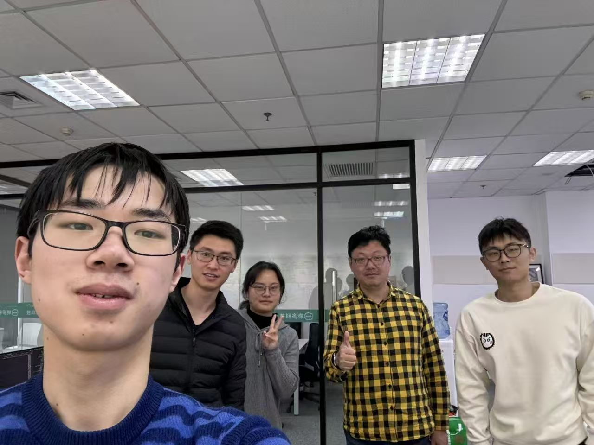
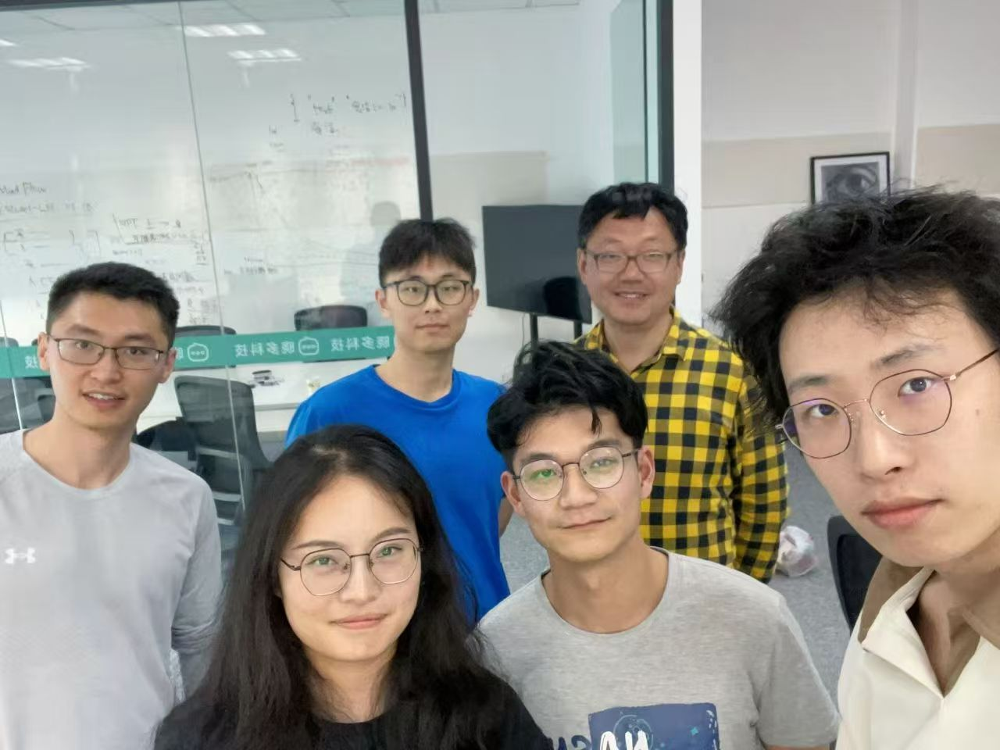
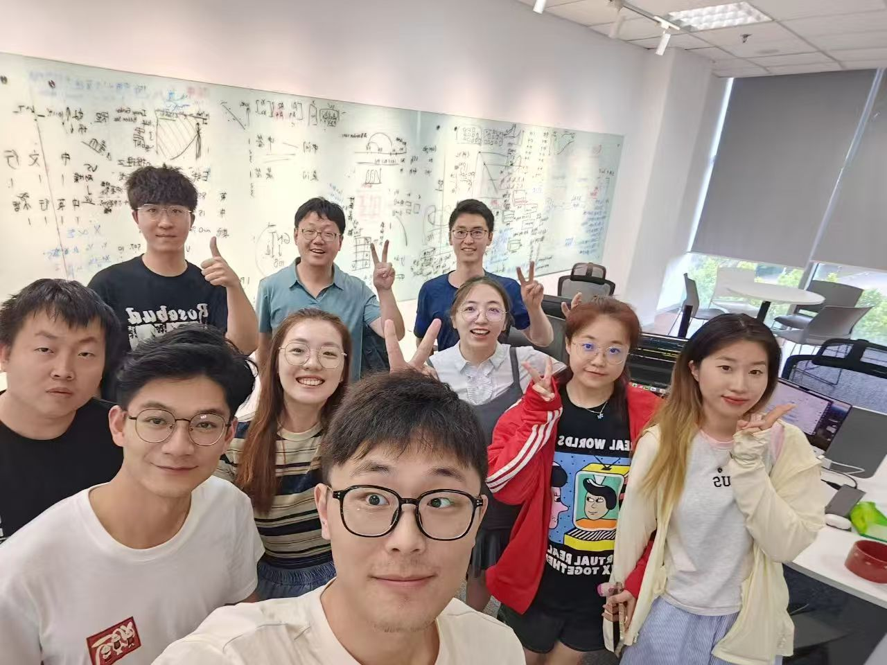
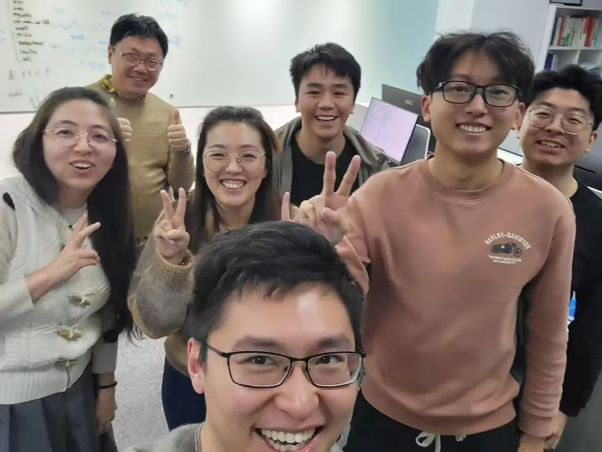
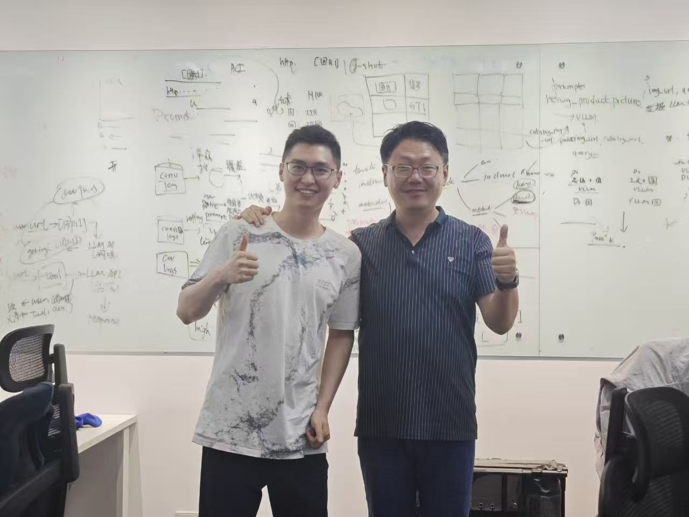
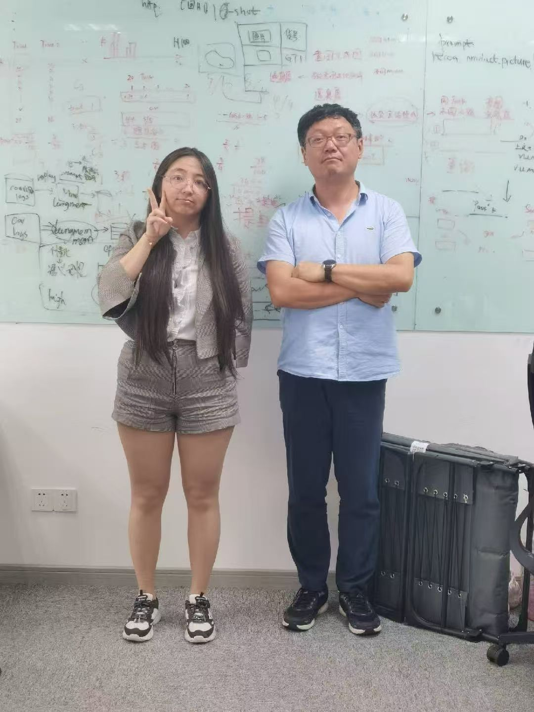
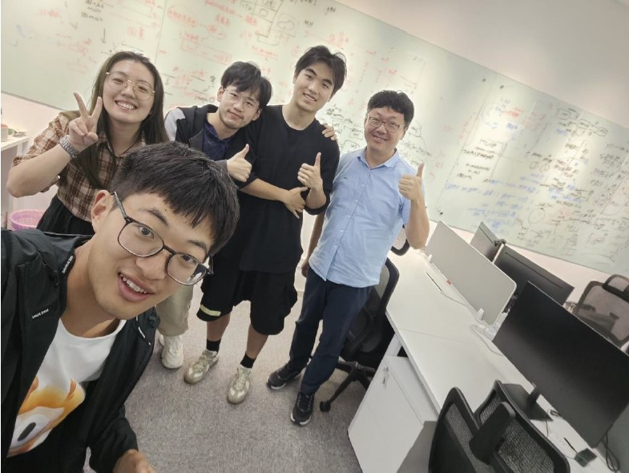
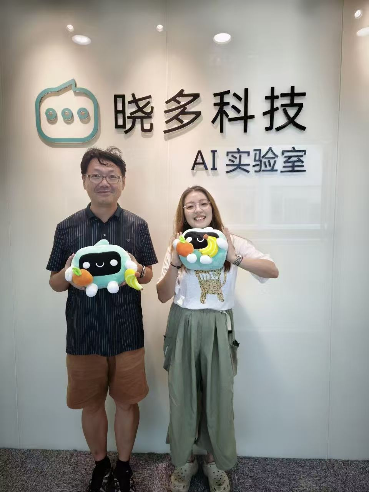
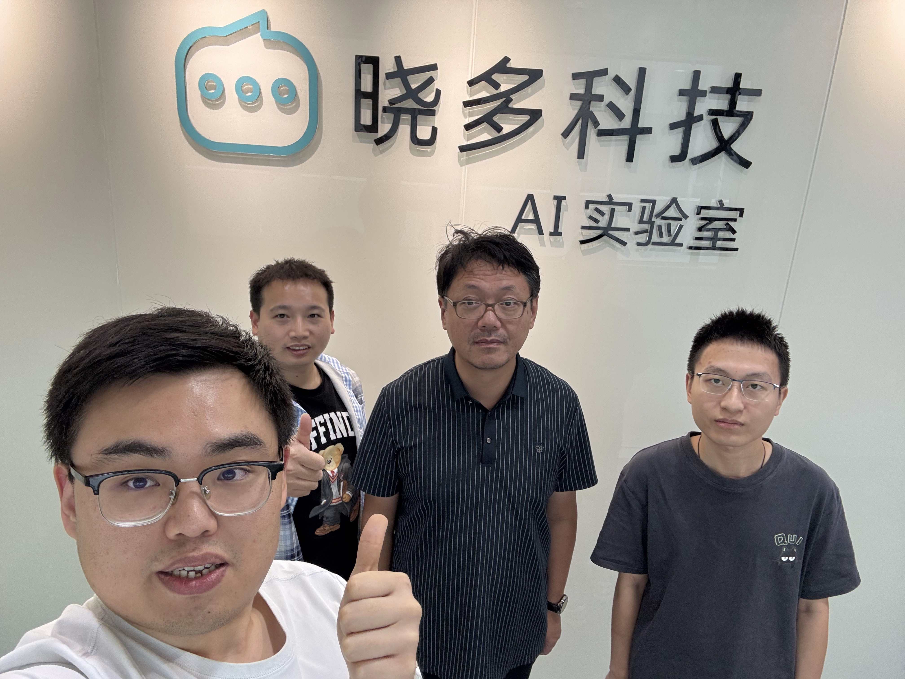

# 晓多AI实验室 - 项目归档

> 技术讨论记录与研究档案 (2023-2025)

本仓库包含晓多AI实验室的技术讨论记录和研究档案，实验室运营时间为2023年11月至2025年9月。实验室专注于多模态AI、大语言模型和电商AI应用的前沿研究。

## 📁 仓库内容

- **`XiaoduoAILab_Discussion_LogBook_2023_11_14-2025_9_24.pdf`** - 实验室运营期间完整的技术讨论记录
- **研究论文** - 实验室期间产出的主要出版物和技术报告

## 🎯 研究方向

实验室专注于以下几个关键AI研究领域：

- **多模态视觉语言模型** - 连接视觉与文本理解
- **大语言模型** - 开发高效、多语言的LLM
- **电商AI应用** - 客户支持自动化和智能体系统
- **记忆增强AI系统** - 具备记忆能力的增强型对话AI

## 📚 主要出版物 (2023-2025)

### 视觉语言模型
- **Xmodel-VLM: A Simple Baseline for Multimodal Vision Language Model** - *arXiv*

### 大语言模型
- **Xmodel-LM Technical Report** - *arXiv*
- **Xmodel-1.5: An 1B-scale Multilingual LLM** - *arXiv*
- **Xmodel-2 Technical Report** - *arXiv*

### 电商AI系统
- **MindFlow: Revolutionizing E-commerce Customer Support with Multimodal LLM Agents** - *arXiv*
- **ECom-Bench: Can LLM Agent Resolve Real-World E-commerce Customer Support Issues?** - *EMNLP 2025*
- **MemOrb: A Plug-and-Play Verbal-Reinforcement Memory Layer for E-Commerce Customer Service** - *arXiv*

### 综述与分析
- **Survey of Specialized Large Language Model** - *arXiv*

## 🔬 技术贡献

### 模型开发
- **Xmodel系列**：开发了从1B到更大参数规模的高效、可扩展语言模型
- **多模态集成**：创建了视觉语言理解的统一框架
- **记忆系统**：创新了即插即用的记忆层，用于增强对话AI

### 基准测试与评估
- **ECom-Bench**：建立了电商AI系统的全面评估框架
- **真实场景测试**：在实用客户支持场景下验证模型性能

### 应用研究
- **客户支持自动化**：开发了用于电商应用的多模态智能体
- **多语言能力**：专注于跨语言模型性能
- **效率优化**：强调模型效率和实际部署

## 📊 时间线

- **2023年10月**：实验室成立和初步研究方向确定
- **2023年11月**：启动 Xmodel-LM 预研
- **2024年1月**：启动 Xmodel-VLM 预研
- **2024年5月**：Xmodel-VLM 论文上传 arXiv
- **2024年5月**：启动 MindFlow 预研
- **2024年5月**：启动 Xmodel-1.5 预研
- **2024年6月**：Xmodel-LM 论文上传 arXiv
- **2024年8月**：启动 Xmodel-2 预研
- **2024年11月**：Xmodel-1.5 论文上传 arXiv
- **2024年12月**：Xmodel-2 论文上传 arXiv
- **2025年3月**：启动 ECom-Bench 预研
- **2025年7月**：ECom-Bench 和 MindFlow 论文提交 EMNLP 2025 Industry Track，并上传 arXiv
- **2025年9月**：MemOrb 论文提交 ICLR 2026，并上传 arXiv
- **2025年9月**：实验室关闭和档案创建

## 📸 实验室成员合影

以下是实验室运营期间部分成员的离职合影，记录了实习生同学们的姓名、学校、贡献和拍摄时间：

| | | |
|:---:|:---:|:---:|
|  **严煜**（哈尔滨工业大学威海校区） **自研Tokenizer** （2024/1）|  **徐婉婷/何浪平** （华东师范大学/东华大学,左二左四） **Xmodel-VLM** （2024/5）|  **王一川**（上海交通大学） **Xmodel-LM** （2024/6）|
|  **林清权/曲志久** （武汉大学/复旦大学，右二/右一） **Xmodel-2** （2024/12） |  **刘杨/黄旭程** （全职，北京大学/埃尔朗根纽伦堡大学，右/左） **分布式训练框架等** （2025/6） |  **王群**（上海海事大学） **Xmodel-1.5+Xmodel-2** （2025/6） |
|  **王浩新/彭显涵/杨承汉** （上海交通大学，左三/左四/左二） **ECom-Bench**（王/彭） **领域模型/领域智能体综述**(杨) （2025/6） |  **龚鸣**（戴顿大学） **MindFlow** （2025/8）|  **黄一哲**（复旦大学，右一） **MemOrb** （2025/9）|

## 🤝 致谢

我们学习和参考了AI社区的论文和大量开源成果，同时也尝试在力所能及的范围内回馈社区。

## 📄 许可证

本档案为研究和教育目的而维护。具体许可信息请参考各出版物。

## 🔗 相关资源

如需访问实际模型、数据集或实现代码，请参考与各论文相关的独立仓库。

---

*本档案作为晓多AI实验室2023-2025年技术贡献的全面记录。*
