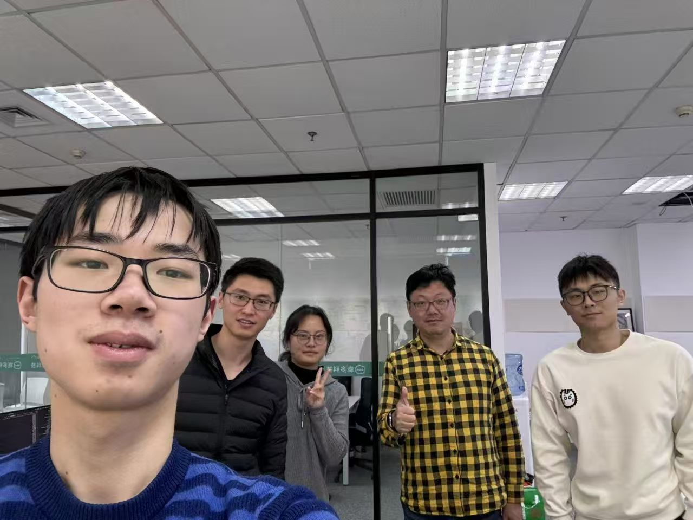
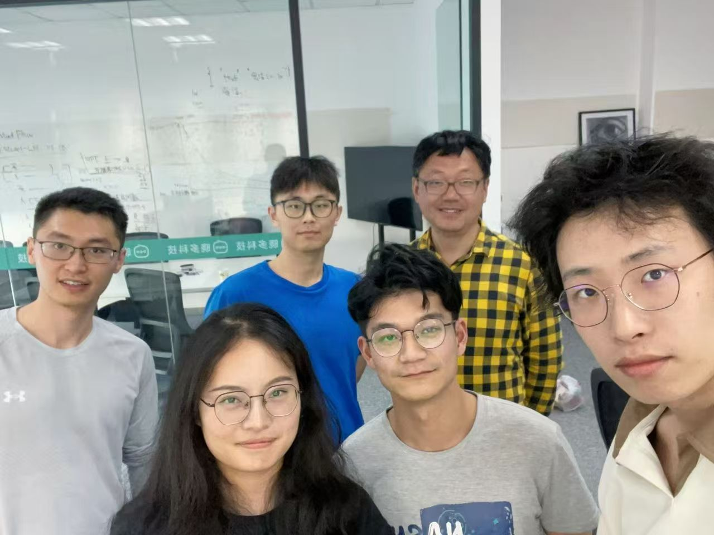
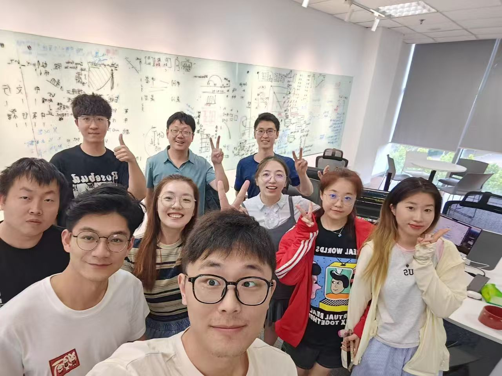
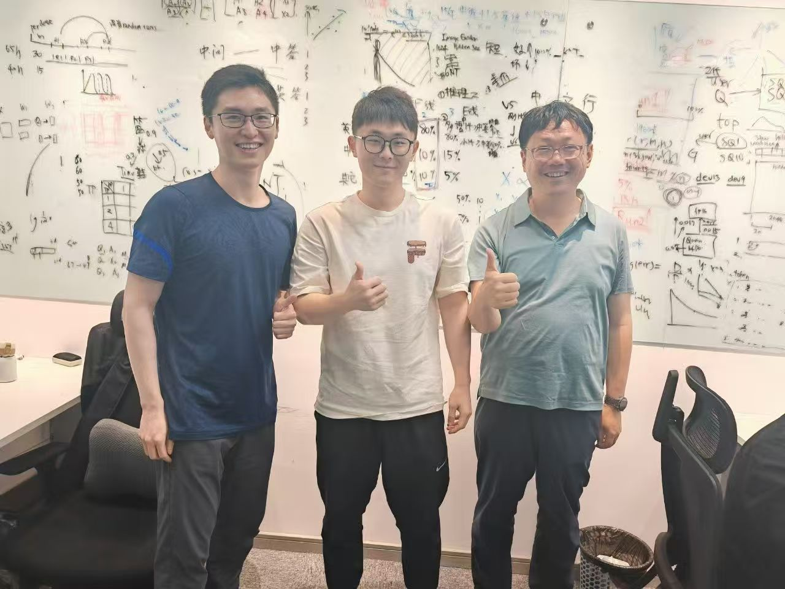
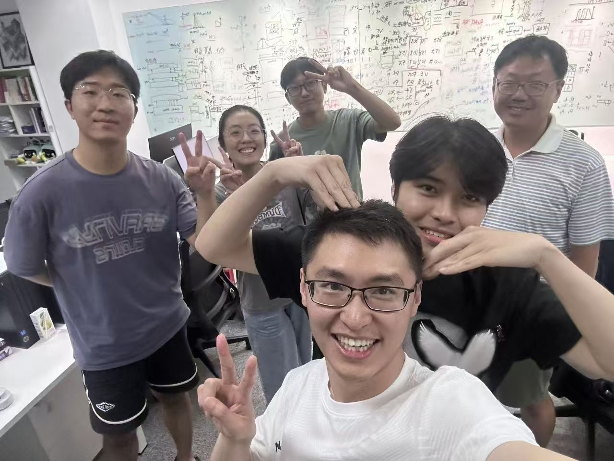
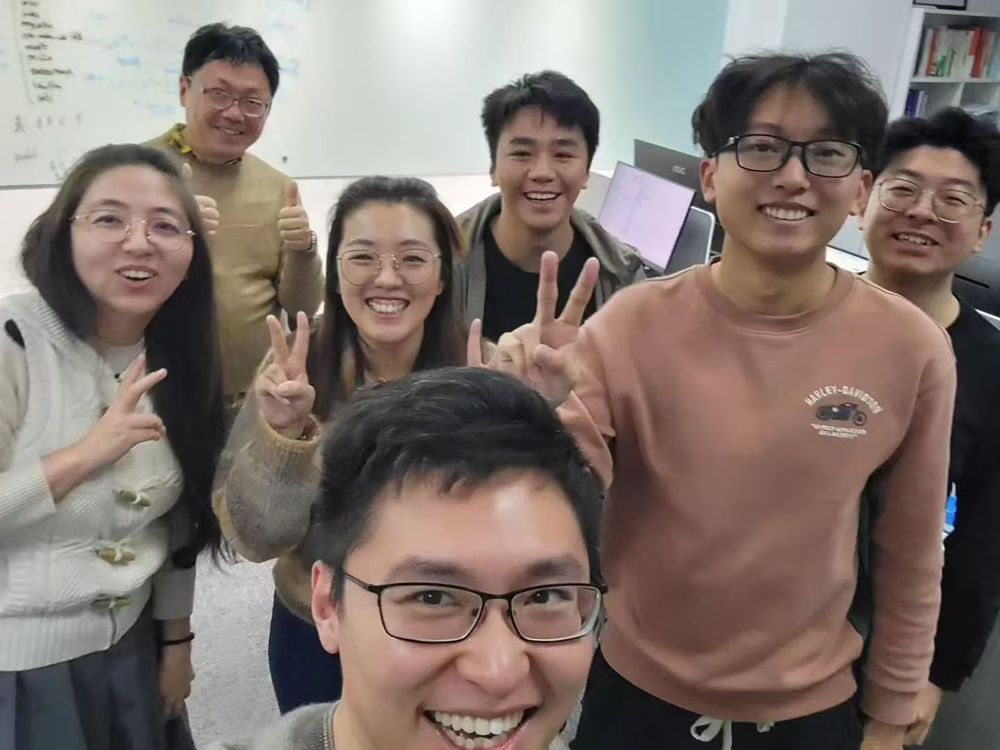
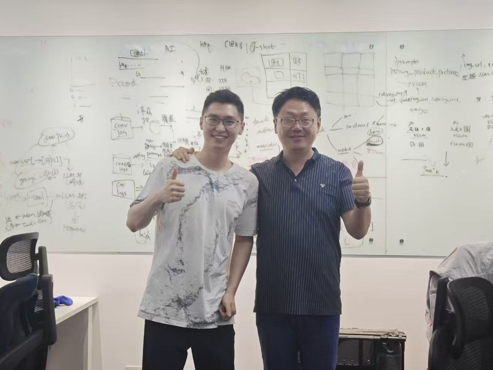
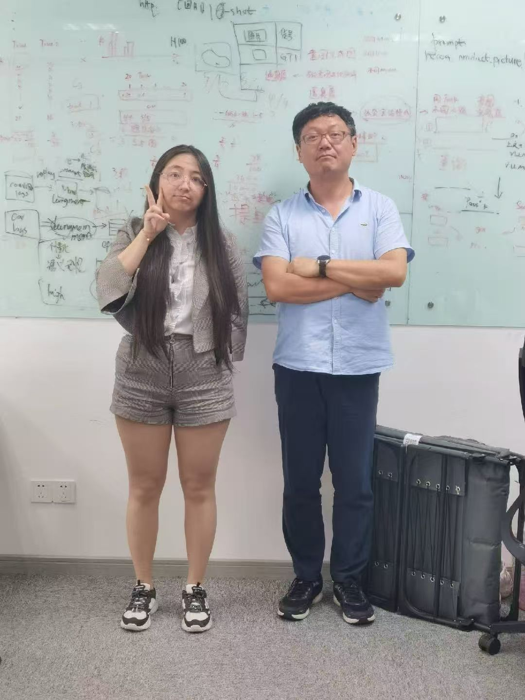
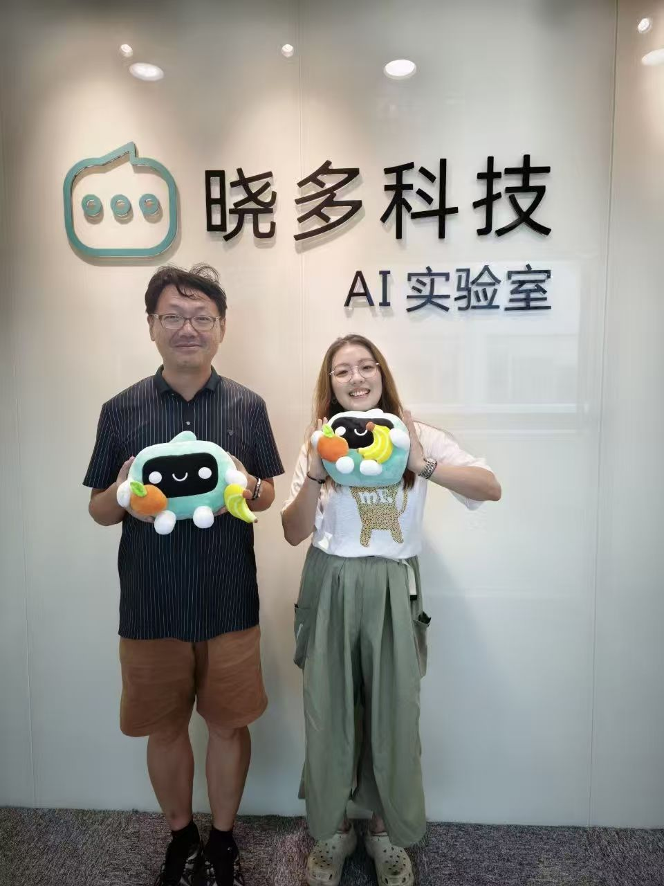

| | | |
|:---:|:---:|:---:|
|  **严煜**/哈尔滨工业大学（威海校区）/自研Tokenizer/2024年1月 |  **徐婉婷**/华东师范大学/Xmodel-VLM/2024年5月 |  **王一川**/上海交通大学/Xmodel-LM/2024年6月 |
|  **Xmodel-LM发布** <small>2024年6月</small> |  **团队建设活动** <small>2024年8月</small> |  **MindFlow项目研讨** <small>2024年10月</small> |
|  **ECom-Bench开发** <small>2025年3月</small> |  **王群**/上海海事大学/Xmodel-1.5+Xmodel-2/2025年6月 |  **实验室告别合影** <small>2025年9月</small> |

